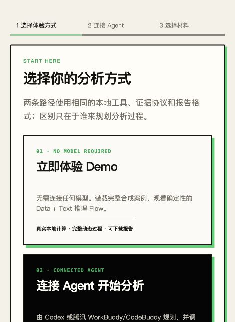
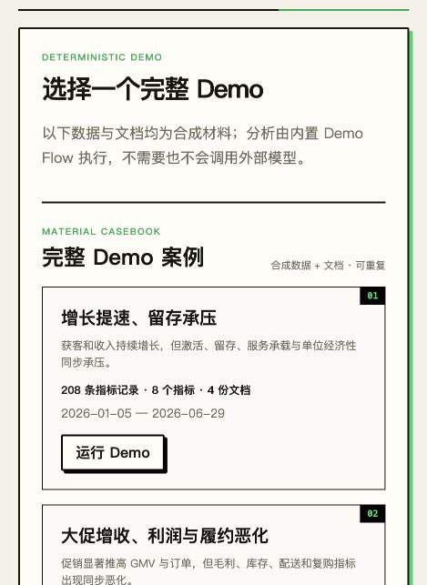
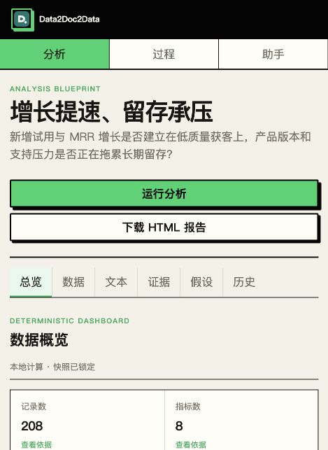
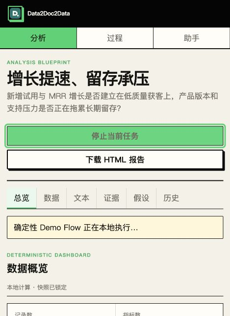
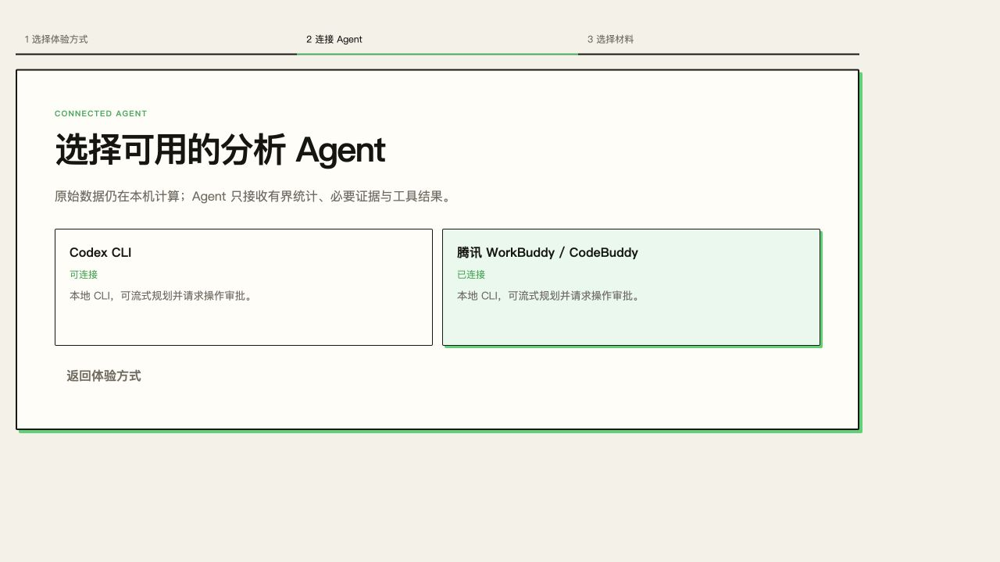
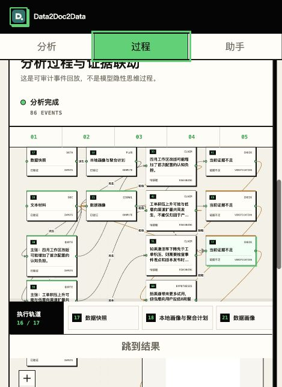

# Data2Doc2Data Goal Review

Date: 2026-08-24

> Historical audit note: this document records the product state observed on 2026-08-24. The 2026-08-25 close-out below supersedes its open-item verdict without rewriting the original evidence.

## 2026-08-25 close-out

The release-blocking gaps identified here were closed in Task 28:

- Connected mode now runs a bounded plan–execute–observe–revise cycle. Codex or WorkBuddy chooses the next local tool after each persisted artifact, reuses the same provider session, and can reconnect after transient failures without receiving raw datasets.
- Demo and Connected runs now share the same maximum-three-round host-controlled execution contract, artifact dashboard, evidence graph, replay model, and offline HTML report. The UI explicitly distinguishes deterministic planning from `Agent 规划`.
- Readable event scheduling, real tool lifecycle events, stable canvas fitting, round/artifact progress, and recovery semantics are covered by unit and browser tests.
- Diagnostic artifacts and exported reports now expose business-readable methods, sample counts, scalar/detail evidence, text ML outputs, limitations, and references.
- The mobile analysis tabs, diagnostic cards, fixed assistant composer, Paper Desk run history, and 390 px overflow behavior were rechecked and hardened.

The remaining boundaries are intentional rather than unfinished promises: private model chain-of-thought is not exposed; candidate knowledge is not promoted without verification; OpenAI-compatible API registration remains a backend/provider extension rather than a primary local-CLI onboarding path; and live-provider checks remain environment-dependent. The complete round-by-round evidence is in `docs/testing/2026-08-25-twenty-round-iteration.md`.

## Historical follow-up implementation status (2026-08-24)

The highest-impact live-Flow gaps found in this audit were addressed after the initial review:

- SSE bursts are now coalesced by animation frame and replayed with adaptive semantic pacing. A 125-event flagship run completes its readable presentation in about 6.8–7.3 seconds instead of appearing at once or taking roughly 30 seconds to render.
- The canvas exposes a pending-event count and “跳到实时” control; reduced-motion mode still presents the complete result immediately.
- Real `step.started`, `step.completed`, `step.failed`, `tool.started`, `tool.result`, `tool.failed`, and measured `duration_ms` events now surround actual local tool invocation.
- `step.added` events now draw the tool DAG and dependencies before evidence nodes exist.
- Bundled Demo hypotheses now execute `test_hypothesis`; supported and contradicted results update nodes and edges. Unstructured free-text hypotheses remain pending instead of being mislabeled as tested.
- Conclusion, recommended-action, and report nodes now close the delivery lane.

The overall product verdict at the time remained **not yet 100% complete**. The bounded connected Agent was still a one-shot plan author rather than a plan–execute–observe–revise loop; OpenAI-compatible API onboarding, governed knowledge UI/reuse, authoritative `demo-flow.json` execution, and mobile Process hierarchy remained open.

## Historical verdict (2026-08-24)

The engineering foundation was substantial, but the product goal had not yet been fully achieved. The tracker marked the Agent Flow rebuild complete too early. The largest gap was that the system persisted granular events but did not yet turn them into a readable live analysis experience; the connected Agent also authored one static plan rather than participating in a bounded plan–execute–observe–revise loop.

## Flow reviewed

1. **Mode selection — healthy.** Demo and connected analysis are clearly separated.
2. **Demo material selection — healthy.** Two complete synthetic material packs are visible and correctly labeled.
3. **Material loading and deterministic dashboards — healthy.** Data and text dashboards are computed locally before the run.
4. **Run analysis — needs work.** The UI briefly enters a running state, but the synchronous engine emits events in a burst. Most graph/results become available too quickly to follow.
5. **Completed Flow — needs work.** The graph is auditable after completion, but planning/tool execution is not sufficiently represented as an understandable live sequence. On mobile, selecting “过程” still requires scrolling past the task header and KPI block before the canvas becomes primary.
6. **Connected provider selection — partial.** Codex and WorkBuddy are available, but the OpenAI-compatible API configuration that exists in the backend is not exposed here and is not wired into the connected Flow runner.

## Goal matrix

| Goal | Status | Evidence |
|---|---|---|
| No-model Demo and connected Agent are separate journeys | Complete | Two explicit entry cards and separate task modes |
| Two reusable data + text material packs | Complete | 468 records and 9 documents across two packs |
| Local-first data/text tools and bounded context | Mostly complete | Typed local tools, snapshots, safe summaries, source resolver |
| Agent understands the request and recursively coordinates tools | Partial | Agent creates one validated DAG; host then executes it without returning tool results to the Agent for revision |
| Real live dynamic canvas | Partial | Events and XYFlow exist, but synchronous burst delivery, missing real `tool.progress`, and no readable scheduling make the result appear at once |
| Evidence-backed conclusions and hypothesis graph | Partial | Nodes/edges/provenance exist; Demo validations are currently created as `insufficient`, and connected tool results are not fully projected into final hypothesis/conclusion nodes |
| Fixed Agent Console and correct scroll ownership | Complete on desktop; mostly complete on mobile | Composer is fixed, history scrolls; mobile process hierarchy still needs refinement |
| Durable CLI sessions, reconnect, resume and cursor replay | Mostly complete | Session supervision and cursor replay exist; real Codex planning still timed out in the observed environment |
| Shared offline HTML report from Web/CLI/MCP | Complete | One trusted report builder and working download/CLI/MCP surfaces |
| Codex, WorkBuddy and OpenAI-compatible API onboarding | Partial | Local CLIs appear; API registry is backend-only and not an executable web Agent option |
| Governed knowledge evolution | Backend foundation only | Candidate/version/verify/supersede storage exists; no workbench governance UI or verified-knowledge feedback into later runs |
| Native Codex/DeepSeek/WorkBuddy plugin form | Mostly complete | MCP tools and host templates exist; only WorkBuddy had a successful real live browser check in the latest release run |

## Why Demo results appear together

`DemoFlowRunner` and `ConnectedFlowRunner` share `AgentFlowEngine`. The engine calls tools synchronously and emits dozens of persisted events without a semantic pacing boundary. SSE then delivers those events in batches, and React immediately projects all received events. The Demo run therefore has a real event stream, but it is not a readable event presentation stream.

The same issue affects real analysis after planning. Connected mode adds a potentially long Agent-planning phase, but once the plan is validated, the host executes local tools through the same synchronous engine. Large or slow inputs may naturally spread events out, but fast local analysis still jumps from “working” to a nearly complete graph. The UI currently has no display queue, event grouping, or “live versus replay” policy.

## Highest-impact recommendations

1. **Separate execution time from presentation time.** Persist events immediately, then use a client-side semantic event scheduler. Live results remain truthful; fast bursts are grouped into stages and revealed at a readable 150–350 ms cadence. Offer “跳到实时/立即完成” and never add artificial sleeps to CLI/MCP computation.
2. **Emit real lifecycle events.** Add `step.started/completed`, per-tool duration, bounded `tool.progress`, `node.updated`, conclusion/action nodes, and phase checkpoints. Tool nodes should appear from `step.added`, before evidence results exist.
3. **Turn connected mode into a bounded Agent loop.** Plan one or more steps, execute locally, return bounded results to the Agent, allow a validated revision, and repeat within step/time budgets. If the product keeps a one-shot DAG, label it “Agent 规划、本地执行” rather than implying recursive orchestration.
4. **Make the Demo manifest authoritative.** Execute `demo-flow.json` stages instead of deriving a separate hard-coded plan; attach explicit showcase milestones and expected branch semantics without injecting answers into connected mode.
5. **Finish hypothesis/conclusion projection.** Convert actual `test_hypothesis` results into supported/contradicted/insufficient nodes and evidence edges. Connected plan tool results must affect the final graph and report.
6. **Complete the missing product surfaces.** Add OpenAI-compatible API onboarding/execution, knowledge candidate approval/history/reuse UI, and a mobile Process mode that opens directly on a full-height canvas.

## Accessibility and evidence limits

- Status messages use live-region semantics and controls have accessible names.
- The completed mobile canvas is visually dense; node labels and edge relationships become difficult to read at the captured scale. A list/tree alternative and direct node focus are needed for robust non-visual navigation.
- Screenshots cannot prove full keyboard navigation, screen-reader output, contrast ratios, reconnect behavior, or provider-side correctness. Those require dedicated interaction and assistive-technology tests.
- No browser console warnings or errors were observed during this audit.

## Screenshots

